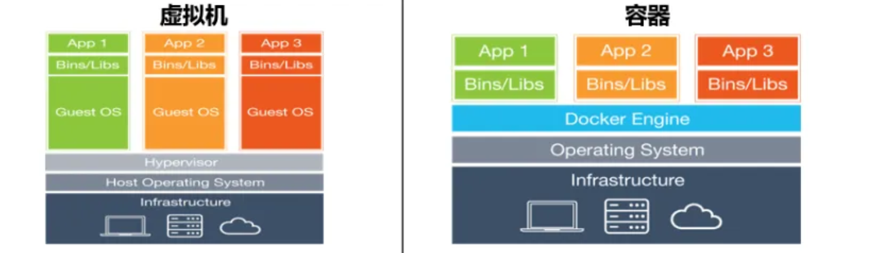
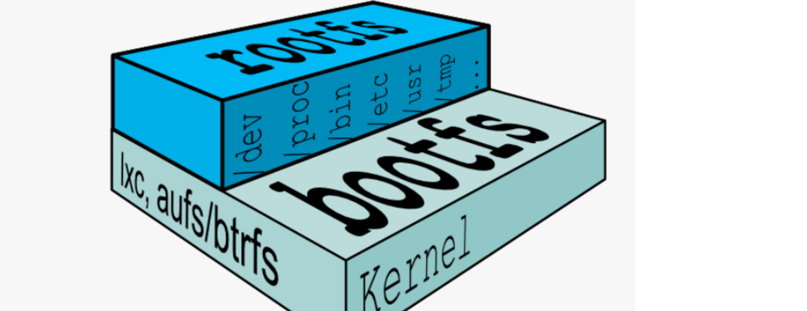
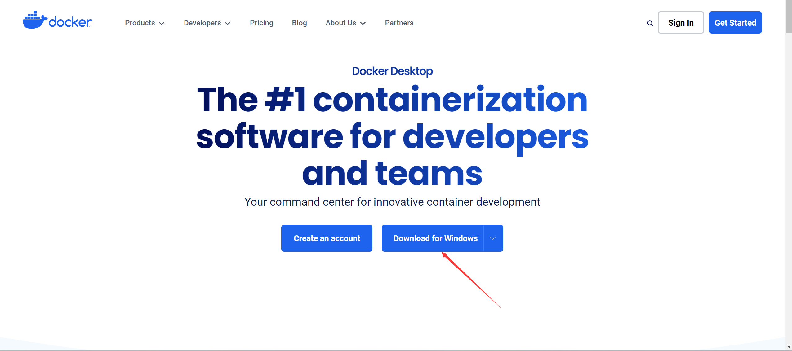
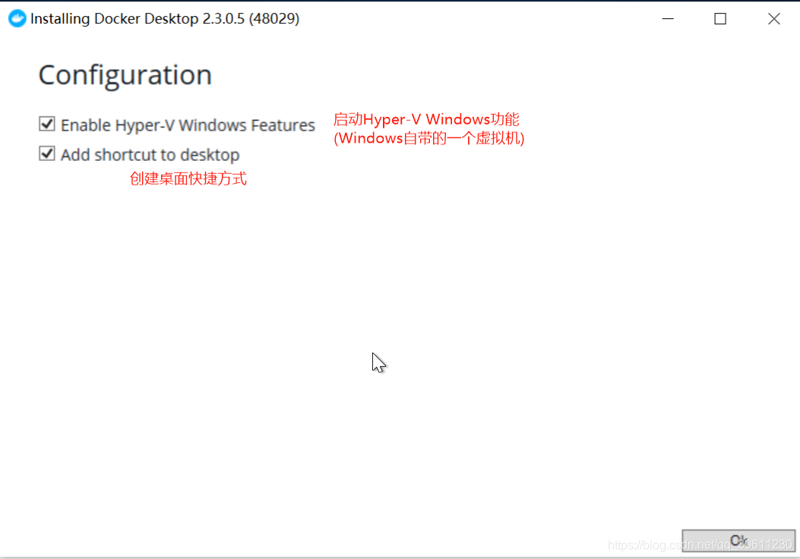
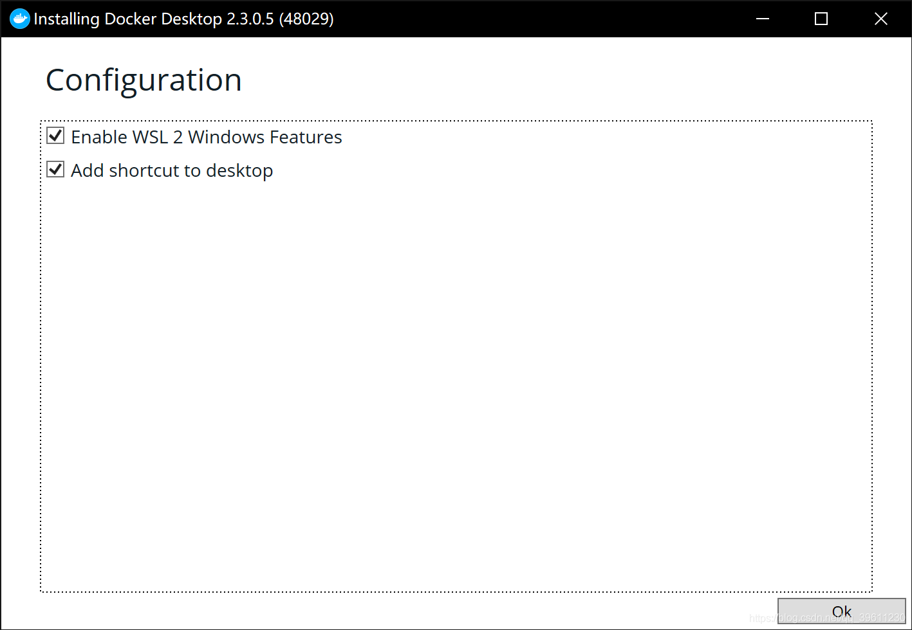
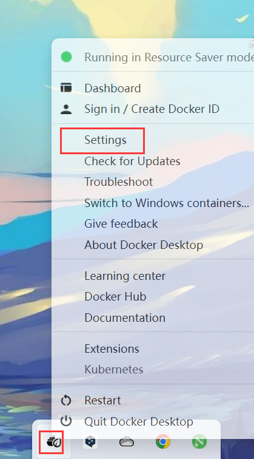
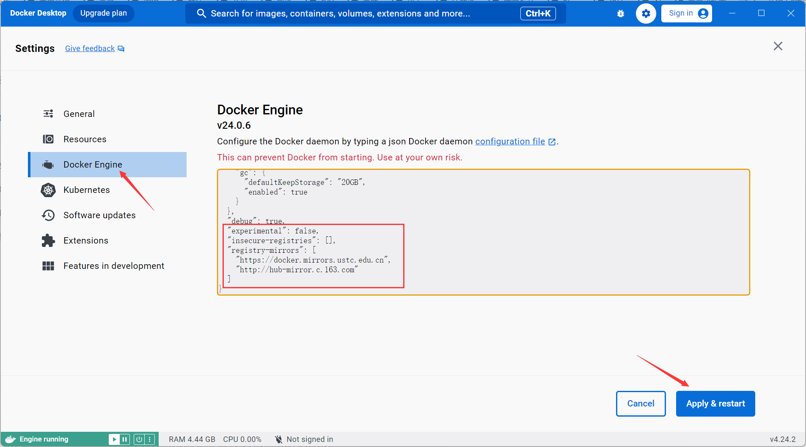
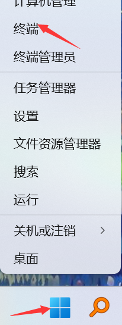
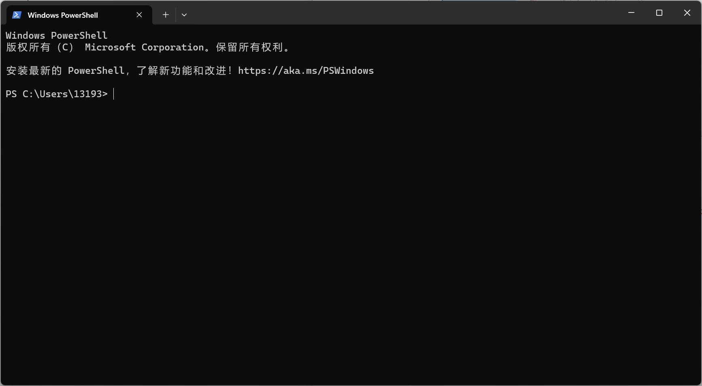

# Docker

Docker 是一个开源的应用容器引擎，它允许开发者将应用及其依赖打包到一个可移植的容器中，然后发布到任何流行的 Linux 机器或 Windows 机器上，也可以实现虚拟化。容器是完全使用沙箱机制，相互之间不会有任何接口。

Docker 主要由容器、镜像和仓库三部分组成。

1. **镜像（Image）**：Docker 镜像可以看作是容器的模板。镜像可以包含一个完整的操作系统，也可以只包含一个应用程序及其运行环境。开发者可以基于镜像来创建 Docker 容器。镜像是只读的，你不能修改镜像，只能创建新的镜像。
2. **容器（Container）**：容器是镜像的运行实例。你可以从同一个镜像启动多个容器。容器可以启动、停止、删除，每个容器都是相互隔离的，拥有自己的文件系统，不会互相影响。
3. **仓库（Repository）**：镜像便于传播,而仓库就是专门用来传播这些镜像的地方,他有点类似与Github,或者你可以把他看成一个存放各种镜像的镜像商店
   [Docker官方的仓库](https://hub.docker.com/): 他的服务器处于国外,所以下载速度较慢,不过我们可以通过换源解决。
   [daocloud国内仓库](https://hub.daocloud.io/): 国内也有一些优秀的商店，他和Docker官方的仓库的区别类似与Github和Gitee的区别。
   [网易云镜像中心](https://c.163yun.com/hub#/home)

## 容器

容器和虚拟机比较类似，都可以为应用提供封装和隔离，都是软件，但是容器中的应用运行是寄托于宿主操作系统的，实际上依然是在直接使用操作系统的资源，当然应用程序之间环境依然是隔离的，而虚拟机则是完全模拟一台真正的电脑出来，直接就是两台不同的电脑。



## 镜像

容器的基石是镜像，有了镜像才能创建对应的容器实例

一个基本的操作系统环境我们称为base镜像，一般base镜像就是各个Linux操作系统的发行版，比如我们正在使用的Ubuntu，还有CentOS、Kali等等

不像我们使用完整系统一样，base镜像省去了内核，所以大小一般只有几百MB到几十MB，这里需要解释一下base镜像的机制：



Linux操作体系由内核空间和用户空间组成，其中内核空间就是整个Linux系统的核心，Linux启动后首先会加载`bootfs`文件系统，加载完成后会自动卸载掉，之后会加载用户空间的文件系统，这一层是我们自己可以进行操作的部分：

- bootfs包含了BootLoader和Linux内核，用户是不能对这层作任何修改的，在内核启动之后，bootfs会自动卸载。
- rootfs则包含了系统上的常见的目录结构，包括`/dev`、`/proc`、 `/bin`等等以及一些基本的文件和命令，也就是我们进入系统之后能够操作的整个文件系统，包括我们在Ubuntu下使用的apt和CentOS下使用的yum，都是用户空间上的。

base镜像底层会直接使用宿主主机的内核，也就是说你的宿主机内核版本是多少，那么base镜像中的内核版本就是多少，而rootfs则可以在不同的容器中运行多种不同的版本。所以，base镜像实际上只有它的rootfs，因此只有几百M大小左右。

## 安装Docker Desktop

1.去官网下载安装包：https://www.docker.com/products/docker-desktop/



2.打开安装包加载一会后一般会弹出两个选项,在**较旧的Windows10或之前的系统**会出现如下所示的相关提示。我们把第一个选上,第二个根据需求选择即可



而较新的Windows则会出现一个使用wsl2的提示,如果使用wsl2则docker的性能会发挥更好。如下图,这里推荐使用WSL2,如果之后安装完成后发生报错可能是WSL2版本比较老,需要更新导致的。



### 换源

打开Docker的设置



选择Docker Engine,在其中输入(这里使用的是中国科学技术大学的源,如果想要使用其他源可以自行设置,github上有个项目:[docker_mirror](https://github.com/silenceshell/docker_mirror)可以自动检测在你的网络环境下那个源是最快的)

```json
{
  "registry-mirrors": [
    "https://docker.mirrors.ustc.edu.cn",
    "http://hub-mirror.c.163.com"
  ],
  "insecure-registries": [],
  "debug": true,
  "experimental": false
}

```



## 基本使用

Windows上打开PowerShell，右键Windows徽标





### 对Docker操作

安装完成Docker后,默认每次开机的时候都会自动启动,但我们也可以手动启动,关闭或者重启Docker

```bash
# 启动docker
sudo service docker start
# 重启docker
sudo service docker restart
# 停止docker
sudo service docker stop
```

### 镜像的基础操作

#### 获取当前所有镜像

```powershell
docker images
```

下面表格是显示出来的标签的含义

| 标签       | 含义                                 |
| ---------- | ------------------------------------ |
| REPOSITORY | 镜像所在的仓库名称                   |
| TAG        | 镜像标签                             |
| IMAGEID    | 镜像ID                               |
| CREATED    | 镜像的创建日期(不是获取该镜像的日期) |
| SIZE       | 镜像大小                             |

#### 拉取镜像

除了使用官方的镜像外,我们还可以在仓库中申请一个自己的账号,保存自己制作的进行,或者拉去使用他人的镜像。

```bash
docker pull <镜像名称>

# 比如
docker pull ubuntu
docker pull ubuntu:16.04				#冒号后面一般是版本号或其他备注

# 个人镜像
docker pull <仓库名称/镜像名称>

# 第三方仓库拉取
docker pull <第三方仓库地址/仓库名称/镜像名称>
docker pull hub.c.163.com/library/mysql:latest
```

#### 删除镜像

```bash
docker image rm <镜像名或镜像ID>
或
docker rmi <镜像名或镜像ID>
```

删除镜像的前提是没有使用这个镜像的容器,如果有需要先删除容器(报错:Error response from daemon: conflict: unable to delete 镜像ID (must be forced) - image is being used by stopped container 容器ID则代表有容器使用了此镜像。)

#### 加载镜像

镜像只是一个只读类型的文件,而我们的环境不可能只是一个这样的文件,所以我们需要把这个镜像加载成我们的环境,也就是让他变成容器。

```bash
docker run [可选参数] <镜像名> [向启动容器中传入的命令]

# 比如：
docker run -d --name master centos
docker run -d --name master --privileged=true centos:7.9.2009 /usr/sbin/init
```

| 常用可选参数 | 作用                                                         |
| :----------: | ------------------------------------------------------------ |
|      -i      | 表示以交互模式运行容器。                                     |
|      -d      | 会创建一个守护式容器在后台运行(这样创建容器后不会自动登录容器)。 |
|      -t      | 表示容器启动后会进入其命令行。加入这两个参数后，容器创建就能登录进去。即分配一个伪终端。 |
|    --name    | 为创建的容器命名。(默认会随机给名字,不支持中文字符!!!)       |
|      -v      | 表示目录映射关系，即宿主机目录:容器中目录。注意:最好做目录映射，在宿主机上做修改，然后共享到容器上。 |
|      -p      | 表示端口映射，即宿主机端口:容器中端口。 比如:-p 8080:80 就是将容器中的80端口,映射到主机中的8080端口 |
|  --network   | 表示将主机的网络环境映射到容器中，使容器的网络与主机相同。每个 Docker 容器都有自己的网络连接空间连接到虚拟 LAN。 |

#### 查看容器

```bash
# 查看当前所有正在运行的容器
docker ps
# 查看当前所有的容器
docker ps -a
# 使用过滤器(除了name外,常用的还可以指定id:id= 、所有停止的容器:status=exited,正在运行的容器:status=running 等)
docker ps -f name=指定的名字
# 显示2个上次创建的容器(2可以改变)
docker ps -n 2
# 显示最新创建的容器（包括所有状态）
docker ps -l
# 仅显示ip
docker ps -q
 # 显示容器大小
docker ps -s

```

#### 启动和关闭容器

```bash
# 停止容器
docker stop <容器名或容器id>
# 强制关闭容器
docker kill <容器名或容器id>
# 启动容器
docker start <容器名或容器id>
```

#### 操作后台容器

首先我们确保我们要进入的容器是开启状态的,使用docker ps -a查看其中的STATUS属性是否是Up开头,如果不是先照着上面启动容器的方法开启容器
我们开启容器后,如果需要在容器内执行命令,可以将后台切换到前台,也可能使用docker命令将我们需要执行的命令传入。

```bash
# 如果我只需要执行简单的一两条命令可以使用docker exec
# 执行单条命令 (-i: 启动并且保留交互式命令行; -t:作用是分配一个虚拟的终端; docker run )
docker exec -it <容器名或容器id> <执行的命令>
# 比如
docker exec -it master whoami

# 启动命令行
docker exec -it <容器名或容器id> /bin/bash			# /bin/bash指定启动shell为bash
```

| exec可选参数 | 作用                                                         |
| ------------ | ------------------------------------------------------------ |
| -e           | 设置环境变量。                                               |
| -i           | 表示以交互模式运行容器。                                     |
| -t           | 表示容器启动后会进入其命令行。加入这两个参数后，容器创建就能登录进去。即分配一个伪终端。 |
| -u           | 设置用户名和UID。                                            |
| -w           | 设置容器内的工作目录。                                       |

> [!NOTE]
>
> `-i`和`-t`或一些短参数连用时可以直接写在一起，如`-it`

#### 从主机上传文件到容器

```
docker cp <主机文件路径> <容器名>:<容器里的路径>
比如：
docker cp .\jdk-8u221-linux-x64.tar.gz master:/root/
```

#### 退出容器

```bash
exit
```

#### 删除容器

如我我们需要删除一个容器,首先需要确保这个容器已经停止了,因为正在运行的容器是无法直接删除。

我们可以运行一下docker ps -a,如果发现没有停止,可以使用docker stop停止(STATUS下已Exited开头则是停止的)

```bash
# 使用rm删除容器
docker rm <容器名或容器id>
```

如果报错Error response from daemon: You cannot remove a running container 容器ID. Stop the container before attempting removal or force remove则代表这个容器已经启动,需要执行 docker stop 容器id,停止此容器。

#### 容器制作成镜像

镜像可以看作为是一种备份,如果我们后期环境出现了问题,可以还原到早期镜像。
镜像便于传播,可以让自己的其他设备或他人的重复利用变得更加简单容易。

```bash
# 将容器制作成镜像
docker commit <容器名> <镜像名>
# 镜像打包备份(打包备份的文件会自动存放在当前命令行的路径下,如果想让保存的文件可以打开,可以加.tar后缀)
docker save -o <保存的文件名> <镜像名>
# 镜像解压
docker load -i <文件路径/备份文件>
```


## 搭建大数据环境

### 编写Dockerfile

```bash
FROM centos:7.9.2009
ENV container docker
RUN (cd /lib/systemd/system/sysinit.target.wants/; for i in *; do [ $i == \
systemd-tmpfiles-setup.service ] || rm -f $i; done); \
rm -f /lib/systemd/system/multi-user.target.wants/*;\
rm -f /etc/systemd/system/*.wants/*;\
rm -f /lib/systemd/system/local-fs.target.wants/*; \
rm -f /lib/systemd/system/sockets.target.wants/*udev*; \
rm -f /lib/systemd/system/sockets.target.wants/*initctl*; \
rm -f /lib/systemd/system/basic.target.wants/*;\
rm -f /lib/systemd/system/anaconda.target.wants/*;
RUN yum -y install iproute firewalld wget openssh-server openssh-clients which
VOLUME [ "/sys/fs/cgroup" ]
CMD ["/usr/sbin/init"]
```

### 构建镜像

```bash
docker build -t <镜像名称> <构建目录>
```

即
```bash
docker build -t centos .
```

### 查看镜像

```bash
docker images
```

```
REPOSITORY   TAG          IMAGE ID       CREATED          SIZE
centos       latest       9152fc55782c   18 seconds ago   462MB
```

### 以特权模式运行容器

```bash
docker run -d --name master --hostname=master --restart=always --privileged=true -p 50090:50090 -p 8088:8088 centos:latest /usr/sbin/init
```

若有`docker: Error response from daemon: Ports are not available: exposing port TCP 0.0.0.0:50090 -> 0.0.0.0:0: listen tcp 0.0.0.0:50090: bind: An attempt was made to access a socket in a way forbidden by its access permissions.`这个问题则需要打开Powershell管理员，然后再输入以下命令重启NAT网络：

```bash
net stop winnat
net start winnat
```

> [!TIP]
>
> 这里只映射了master的NameNode Web UI 的 50090 端口，ResourceManager Web UI 的 8088 端口，也就是说NameNode和ResourceManager是安装在master上的。若后期还有其他端口开放的需求，可以制作镜像，然后删除原来的容器运行新的容器并开放端口即可

### 进入容器

```bash
docker exec -it master /bin/bash
```

命令行前缀变为`[root@master /]#`即进入成功

### 其他同样操作

```bash
# slave1
docker run -d --name slave1 --hostname=slave1 --restart=always --privileged=true centos:latest /usr/sbin/init

#slave2
docker run -d --name slave2 --hostname=slave2 --restart=always --privileged=true centos:latest /usr/sbin/init
```

新开两个 Powershell 终端，分别进入容器

```bash
# slave1
docker exec -it slave1 /bin/bash

#slave2
docker exec -it slave2 /bin/bash
```