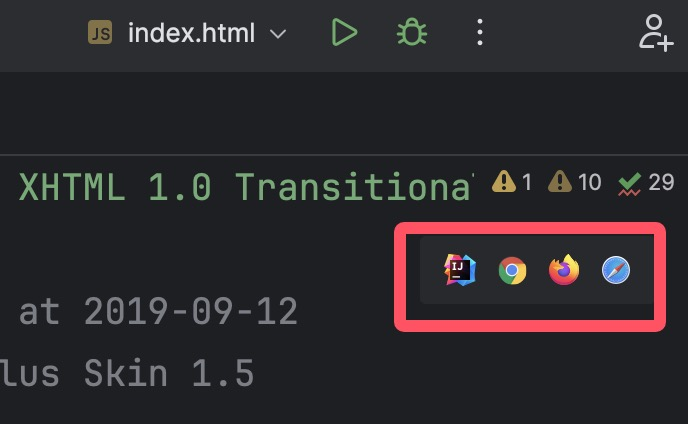
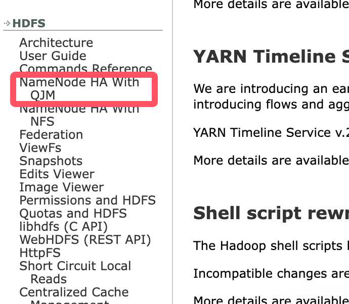
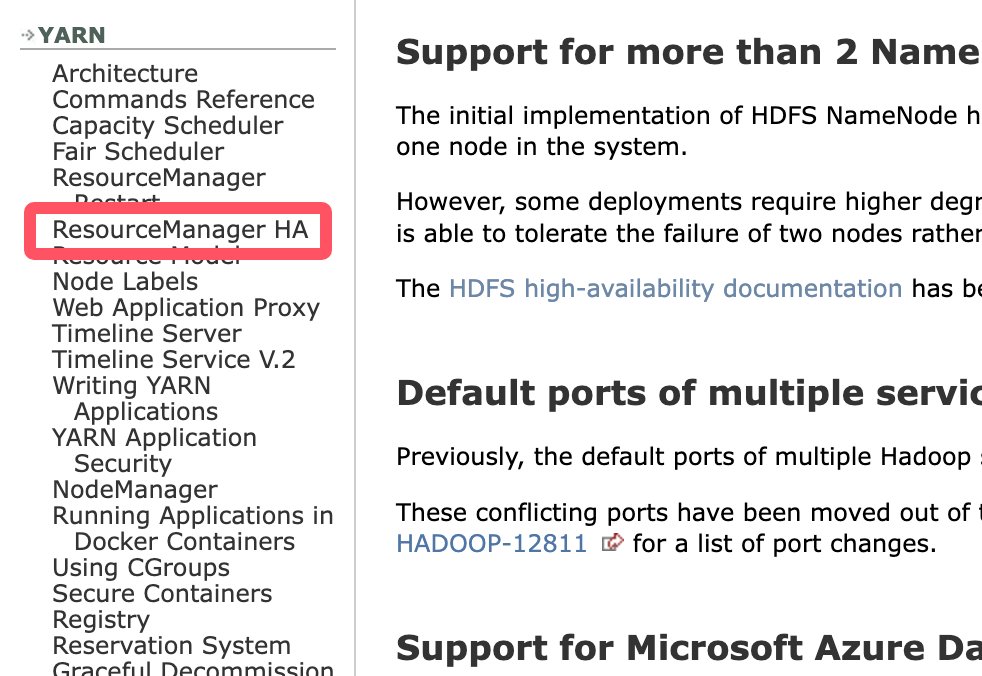

# Hadoop高可用安装配置

## 1、解压hadoop

```bash
[root@bigdata1 module]# tar -zxvf /opt/software/hadoop-3.1.3.tar.gz -C /opt/module/
[root@bigdata1 module]# mv hadoop-3.1.3 hadoop-ha
```

## 2、配置环境变量

```bash
[root@bigdata1 module]# vim /etc/profile.d/bigdata.sh

#HADOOP_HOME
export HADOOP_HOME=/opt/module/hadoop-ha
export PATH=$PATH:$HADOOP_HOME/sbin:$HADOOP_HOME/bin

[root@bigdata1 module]# source /etc/profile
```

## 3、配置hadoopHA

> [!TIP]
> 比赛时可以将hadoop压缩包下载到本地，解压后，使用idea打开`hadoop-3.1.3/share/doc/hadoop`目录，然后打开此目录下的`index.html`文件，点击右上角的浏览器图标，即可查看hadoop的文档。
> 
> 打开之后，点击左侧导航栏`HDFS`->`NameNode HA With NFS`，即可查看hadoop的HDFS高可用文档。
> 
> 点击`YARN`->`ResourceManager HA`，即可查看hadoop的YARN高可用文档。
> 
>

### 3.1、配置hdfs-site.xml

```xml
<!-- nameservices(名称服务)的逻辑名称 -->
<property>
  <name>dfs.nameservices</name>
  <value>hadoopcluster</value>
</property>

<!-- nameservices中每个 NameNode 的唯一标识符-->
<property>
  <name>dfs.ha.namenodes.hadoopcluster</name>
  <value>nn1,nn2</value>
</property>

<!-- 每个 NameNode 监听的 RPC 地址 -->
<property>
  <name>dfs.namenode.rpc-address.hadoopcluster.nn1</name>
  <value>bigdata1:8020</value>
</property>
<property>
  <name>dfs.namenode.rpc-address.hadoopcluster.nn2</name>
  <value>bigdata2:8020</value>
</property>

<!-- 配置自动故障转移 -->
 <property>
   <name>dfs.ha.automatic-failover.enabled</name>
   <value>true</value>
 </property>
```

### 3.2、配置core-site.xml

```xml
<!-- HDFS的默认文件系统URI -->
<property>
  <name>fs.defaultFS</name>
  <value>hdfs://mycluster</value>
</property>

<!-- 指定zookeeper -->
 <property>
   <name>ha.zookeeper.quorum</name>
   <value>bigdata1:2181,bigdata2:2181,bigdata3:2181</value>
 </property>
```

### 3.3、配置yarn-site.xml

```xml
<!-- 配置yarn高可用 -->
<property>
  <name>yarn.resourcemanager.ha.enabled</name>
  <value>true</value>
</property>

<!-- 配置yarn高可用的id -->
<property>
  <name>yarn.resourcemanager.cluster-id</name>
  <value>cluster1</value>
</property>

<!-- 配置yarn高可用的rm-id -->
<property>
  <name>yarn.resourcemanager.ha.rm-ids</name>
  <value>rm1,rm2</value>
</property>

<!-- 配置yarn高可用的rm地址 -->
<property>
  <name>yarn.resourcemanager.hostname.rm1</name>
  <value>bigdata1</value>
</property>
<property>
  <name>yarn.resourcemanager.hostname.rm2</name>
  <value>bigdata2</value>
</property>

<!-- zookeeper地址 -->
<property>
  <name>hadoop.zk.address</name>
  <value>zk1:2181,zk2:2181,zk3:2181</value>
</property>
```

#### 4、配置hadoop使用root启动

```bash
[root@bigdata1 hadoop-3.1.3]# vim start-dfs.sh
```

在文件中添加以下内容：

```
HDFS_DATANODE_USER=root
HDFS_NAMENODE_USER=root
HDFS_SECONDARYNAMENODE_USER=root
```

同理，`stop-dfs.sh`中也需要添加上面的内容，此处不再赘述。

下面，修改`start-yarn.sh`文件

```bash
[root@bigdata1 hadoop]# vim start-yarn.sh
```

```
YARN_RESOURCEMANAGER_USER=root
YARN_NODEMANAGER_USER=root
```

同理，`stop-yarn.sh`中也需要添加上面的内容，此处不再赘述。

## 5、分发hadoop及环境变量

```bash
[root@bigdata1 hadoop-ha]# scp /etc/profile.d/bigdata.sh bigdata2:/etc/profile.d/
[root@bigdata1 hadoop-ha]# scp /etc/profile.d/bigdata.sh bigdata3:/etc/profile.d/

[root@bigdata1 hadoop-ha]# scp -r /opt/module/hadoop-ha/ bigdata2:/opt/module/
[root@bigdata1 hadoop-ha]# scp -r /opt/module/hadoop-ha/ bigdata3:/opt/module/

[root@bigdata1 hadoop-ha]# source /etc/profile
[root@bigdata2 hadoop-ha]# source /etc/profile
[root@bigdata3 hadoop-ha]# source /etc/profile
```

## 6、在 ZooKeeper 中初始化 HA 状态

```bash
[root@bigdata1 hadoop-ha]# hdfs zkfc -formatZK
```

## 7、启动hadoop

```bash
[root@bigdata1 hadoop-ha]# start-all.sh
```

## 8、查看服务nn2与rm2进程状态

```bash
[root@bigdata1 hadoop-ha]# hdfs haadmin -getServiceState nn2

[root@bigdata1 hadoop-ha]# yarn rmadmin -getServiceState rm2
```