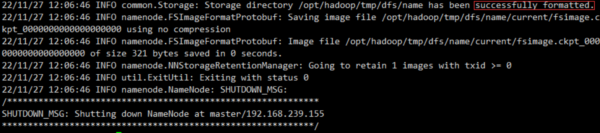

# Hadoop伪分布式环境搭建

## 1 、hadoop安装
任务四:修改 Hadoop 环境变量，并将(/etc/profile)配置文件内容复制粘贴至对应报告中;

任务五:在主机 master 上将 Hadoop 解压到/opt/module 目录下，配置好相关文件(并要求namenode 的web 端访问端口配置为15887，配置指定 MapReduce 程序运行在Yarn 上，指定ResourceManager 的地址 为伪分布式部署所在主机)，将全部命令以及配置文件内容复制并粘贴至对应报告中;
```bash
#上传hadoop安装包到/opt/software/目录下
 #解压tar包到/opt/module/目录下
 [root@master software]# tar -zxvf /opt/software/hadoop-3.1.3.tar.gz -C /opt/module/
```
```bash
 #重命名配置
 [root@master module]# mv hadoop-3.1.3/ hadoop
```
```bash
 #配置环境变量
 [root@master module]# vim /etc/profile
 #HADOOP_HOME
 export HADOOP_HOME=/opt/module/hadoop
 export PATH=$PATH:$HADOOP_HOME/bin:$HADOOP_HOME/sbin
 [root@master module]# source /etc/profile
```
```bash
 [root@master module]# hadoop version
 Hadoop 3.1.3
 Source code repository https://gitbox.apache.org/repos/asf/hadoop.git -r  ba631c436b806728f8ec2f54ab1e289526c90579
 Compiled by ztang on 2019-09-12T02:47Z
 Compiled with protoc 2.5.0
 From source with checksum ec785077c385118ac91aadde5ec9799
 This command was run using /opt/module/hadoop-3.1.3/share/hadoop/common/hadoop-common-3.1.3.jar
```

## 2 、hadoop配置

修改 hadoop-env.sh、yarn-env.sh、mapred-env.sh 设置 Hadoop 环境对应的 JDK

```bash
[root@master hadoop]# vim hadoop-env.sh
export JAVA_HOME=/usr/java/jdk
[root@node01 hadoop]# vim yarn-env.sh
export JAVA_HOME=/usr/java/jdk
[root@node01 hadoop]# vim mapred-env.sh
export JAVA_HOME=/usr/java/jdk
```

修改 core-site.xml 配置文件

```bash
[root@master hadoop]# vim core-site.xml
```

```xml
<configuration> <!--配置hadoop文件系统-->
	<property>
    <name>fs.defaultFS</name>
    <value>hdfs://master:9000</value>
  </property>
<!--临时数据目录，用来存放数据，格式化时会自动生成-->
	<property>
    <name>hadoop.tmp.dir</name>
    <value>/opt/module/hadoop/tmp</value>
  </property>
</configuration>
```

修改 hdfs-site.xml 配置文件

```bash
[root@master hadoop]# vim hdfs-site.xml
```

```xml
<configuration>
<!-- 配置文件副本数 -->
	<property>
        <name>dfs.replication</name>
        <value>1</value>
	</property>
<!-- 配置SecondaryNameNode服务器的主机ip和端口 |yarn地址-->
	<property>
        <name>dfs.namenode.secondary.http-address</name>
        <value>master:50090</value>
	</property>
<!-- 下面为新增要求-->
<!-- namenode 的 web 端访问端口配置为 15887-->
	<property>
        <name>dfs.namenode.http-address</name>
        <value>master:15887</value>
	</property>
</configuration>
```

mapred-site.xml ，把 mapred-sit.xml.template 复制一份，修改为 mapred-site.xml 并配置该文件

```bash
[root@master hadoop]# cp mapred-site.xml.template mapred-site.xml
```

```bash
[root@master hadoop]# vim mapred-site.xml
```

```xml
<configuration> <!---计算框架的运行平台配置 -->
	<property>
        <name>mapreduce.framework.name</name>
        <value>yarn</value>
  </property>
</configuration>
```

yarn-site.xml 添加相应配置

```bash
[root@master hadoop]# vim yarn-site.xml
```

```xml
<configuration>
<!-- Site specific YARN configuration properties --> <!-- 指定Reducer获取数据的方式 -->
	<property>
        <name>yarn.nodemanager.aux-services</name>
        <value>mapreduce_shuffle</value>
	</property>
<!-- yarn主节点rm的位置-->
	<property>
        <name>yarn.resourcemanager.hostname</name>
        <value>master</value>
	</property>
</configuration>
```

在 slaves 配置文件中 添加 主机名，它指定了 DataNode 和 NodeManager 所在的机器

```bash
# 替换 slaves 中的节点名称
[root@master hadoop]# echo master > workers
[root@master hadoop]# cat workers
master
```

## 3 、格式化namenode

任务六:初始化 Hadoop 环境 namenode，将初始化命令及初始化结果复制粘贴至对应报告中

```bash
[root@master hadoop]# hadoop namenode -format
```



## 4 、启动hadoop测试

任务七:启动 hadoop，查看节点 jps 进程，将查看结果复制粘贴至对应报告中

```bash
[root@master hadoop]# start-all.sh
This script is Deprecated. Instead use start-dfs.sh and start-yarn.sh
Starting namenodes on [master]
master: starting namenode, logging to /opt/module/hadoop/logs/hadoop-root-namenode-
master.out
master: starting datanode, logging to /opt/module/hadoop/logs/hadoop-root-datanode-
master.out
Starting secondary namenodes [master]
master: starting secondarynamenode, logging to /opt/module/hadoop/logs/hadoop-root-
secondarynamenode-master.out
starting yarn daemons
starting resourcemanager, logging to /opt/module/hadoop/logs/yarn-root-resourcemanager-
master.out
master: starting nodemanager, logging to /opt/module/hadoop/logs/yarn-root-nodemanager-
master.out
[root@master hadoop]# jps
11120 Jps
10337 NameNode
10455 DataNode
10861 NodeManager
10606 SecondaryNameNode
10751 ResourceManager
[root@master hadoop]#
```

> [!NOTE]
> [参考官方文档](https://hadoop.apache.org/docs/r2.7.7/hadoop-project-dist/hadoop-common/SingleCluster.html)