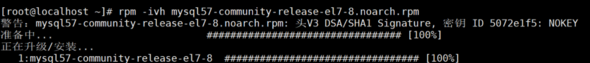
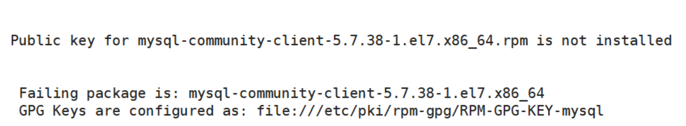

# Hive安装配置

## 一、安装MySQL

**若使用服务器环境，则无需安装与配置MySQL，可以直接安装配置Hive**

### 1、下载wget命令

```bash
yum -y install wget
```

### 2、在线下载mysql安装包

```bash
wget https://dev.mysql.com/get/mysql57-community-release-el7-8.noarch.rpm
```

### 3、安装MySQL

```bash
rpm -ivh mysql57-community-release-el7-8.noarch.rpm
```



### 4、安装mysql服务

首先进入`cd /etc/yum.repos.d/`目录

```bash
cd /etc/yum.repos.d/
```

安装MySQL服务（这个过程可能有点慢）

```bash
yum -y install mysql-server
```

> 若安装MySQL时报错：
>
> 
>
> 原因：MySQL GPG 密钥已过期导致
>
> 解决办法：执行一下命令，解决
>
> ```bash
> rpm --import https://repo.mysql.com/RPM-GPG-KEY-mysql-2022
> ```
>
> 再次重新安装MySQL服务：
>
> ```bash
> yum -y install mysql-server
> ```

> [!NOTE]
>
> MySQL比赛环境已经安装好，比赛时无需安装，但是要授予权限，可能操作的命令如下：

### 5、开启mysql服务

```bash
[root@master yum.repos.d]# systemctl start mysqld
#开机自启动
[root@master yum.repos.d]# systemctl enable mysqld
```

### 6、获取自动生成的随机密码

```bash
[root@master yum.repos.d]# grep 'temporary password' /var/log/mysqld.log
2022-11-27T11:02:13.862460Z 1 [Note] A temporary password is generated for
root@localhost: lgu52Ggl8h*#
```
```bash
[root@master yum.repos.d]# mysql -uroot -p
Enter password:
Welcome to the MySQL monitor.  Commands end with ; or \g.
Your MySQL connection id is 2
Server version: 5.7.40
Copyright (c) 2000, 2022, Oracle and/or its affiliates.
Oracle is a registered trademark of Oracle Corporation and/or its
affiliates. Other names may be trademarks of their respective
owners.
Type 'help;' or '\h' for help. Type '\c' to clear the current input statement.
mysql>
```

### 7、设置mysql的密码安全策略

```mysql
#设置密码强度为低级
mysql> set global validate_password_policy=LOW;
Query OK, 0 rows affected (0.00 sec)

#设置密码长度
mysql> set global validate_password_length=5;
Query OK, 0 rows affected (0.00 sec)

#修改root密码
mysql> ALTER USER 'root'@'localhost' IDENTIFIED BY '123456';
Query OK, 0 rows affected (0.00 sec)
```

### 8、设置远程登录

```mysql
#以新密码登录mysql
[root@master yum.repos.d]# mysql -uroot -p123456
#创建用户
mysql> create user 'root'@'%' identified by '123456';
Query OK, 0 rows affected (0.00 sec)
#允许远程连接(授予权限，很重要!)
mysql> grant all privileges on *.* to 'root'@'%' with grant option;
Query OK, 0 rows affected (0.00 sec)
#刷新权限
mysql> flush privileges;
Query OK, 0 rows affected (0.00 sec)
```

## 二、安装hive

### 1、解压hive

任务一:将Master 节点Hive 安装包解压到/opt/modules/ 目录下，将命令复制并粘贴至粘贴至对应报告中;

```bash
[root@master software]# tar -zxvf apache-hive-2.3.4-bin.tar.gz -C /opt/modules/
```

**改名**

```bash
[root@master modules]# mv apache-hive-2.3.4-bin hive-2.3.4
```

### 2、配置环境变量

任务二:设置 Hive 环境变量，并使环境变量生效，并将环境变量配置内容复制并粘贴至粘贴至对应报告

中;

```bash
[root@master modules]# vi /etc/profile
```

```bash
#HIVE_HOME
export HIVE_HOME=/opt/modules/hive-2.3.4
export PATH=$PATH:$HIVE_HOME/bin
```

```bash
[root@master modules]# source /etc/profile
```

任务三(如下3-5):完成相关配置并添加所依赖包，将 MySQL 数据库作为 Hive 元数据库。初始化 Hive 元数据，并通过 schematool 相关命令执行初始化，将初始化结果复制粘贴至粘贴至对应报告中。

### 3、配置hive

将mysql-connector-java-5.1.48-bin.jar文件上传到hive下的lib目录下

```bash
[root@master software]# mv mysql-connector-java-5.1.48-bin.jar /opt/modules/hive-2.3.4/lib/
```

修改hive-site.xml文件(没有该文件名，将hive-default.xml.template复制并改名为hive-site.xml)

```bash
[root@master modules]# cd /opt/modules/hive-2.3.4/conf
[root@master conf]# cp hive-default.xml.template hive-site.xml
```

```bash
[root@master conf]# vi hive-site.xml
```

> [!TIP]
>
> vi中编辑文件小技巧：在命令模式下，先输入`gg`把光标移动到第一行第一列，然后输入`dG`删除所有行

```xml
<configuration>
	<!-- Hive 产生的元数据存放位置-->
	<property>
		<name>hive.metastore.warehouse.dir</name>
		<value>/usr/hive_remote/warehouse</value>
		<!--若/usr/hive_remote/warehouse路径 没有，则自行创建-->
	</property>
<!--需要登录MySQL数据库，创建一个 hive 数据库备用-->
	<property>
        <name>javax.jdo.option.ConnectionURL</name>
        <value>jdbc:mysql://master:3306/hive?
createDatabaseIfNotExist=true&amp;useSSL=false</value>
	</property>
<!--安装MySQL数据库的驱动类-->
	<property>
        <name>javax.jdo.option.ConnectionDriverName</name>
        <value>com.mysql.jdbc.Driver</value>
	</property>
<!--安装MySQL数据库的名称-->
	<property>
        <name>javax.jdo.option.ConnectionUserName</name>
        <value>root</value>
	</property>
<!--安装MySQL数据库的密码-->
	<property>
        <name>javax.jdo.option.ConnectionPassword</name>
        <value>123456</value>
	</property>
<!--cli 显示表头和列名-->
	<property>
        <name>hive.cli.print.header</name>
        <value>true</value>
	</property>
	<property>
        <name>hive.cli.print.current.db</name>
        <value>true</value>
	</property>
</configuration>
```

### 4、初始化mysql元数据库

```bash
[root@master conf]# cd ..
[root@master hive-2.3.4]# bin/schematool -dbType mysql -initSchema
SLF4J: Class path contains multiple SLF4J bindings.
SLF4J: Found binding in [jar:file:/opt/hive/lib/log4j-slf4j-impl-
2.6.2.jar!/org/slf4j/impl/StaticLoggerBinder.class]
SLF4J: Found binding in [jar:file:/opt/hadoop/share/hadoop/common/lib/slf4j-
log4j12-1.7.10.jar!/org/slf4j/impl/StaticLoggerBinder.class]
SLF4J: See http://www.slf4j.org/codes.html#multiple_bindings for an explanation.
SLF4J: Actual binding is of type [org.apache.logging.slf4j.Log4jLoggerFactory]
Metastore connection URL:    jdbc:mysql://master:3306/hive?
createDatabaseIfNotExist=true&useSSL=false
Metastore Connection Driver :    com.mysql.jdbc.Driver
Metastore connection User:   root
Starting metastore schema initialization to 2.3.0
Initialization script hive-schema-2.3.0.mysql.sql
Initialization script completed
schemaTool completed
```

> [!TIP]
>
> 若出现以下错误，则需要取mysql中新建hive数据库
>
> ```
> org.apache.hadoop.hive.metastore.HiveMetaException: Failed to get schema version.
> Underlying cause: com.mysql.jdbc.exceptions.jdbc4.MySQLSyntaxErrorException : Unknown database 'hive'
> SQL Error code: 1049
> Use --verbose for detailed stacktrace.
> *** schemaTool failed ***
> ```
>
> 创建数据库：
>
> ```bash
> [root@master hive-2.3.4]# mysql -uroot -p123456
> ```
>
> ```mysql
> mysql> create database hive;
> ```
>

### 5、启动hive

```bash
[root@master hive]# bin/hive 					#注意:启动hive之前一定要启动hadoop
hive>
#查看数据库，测试启动是否成功
hive (default)> show databases;
OK
database_name
default
Time taken: 6.924 seconds, Fetched: 1 row(s)
hive (default)>
```

若查看数据库未成功，比如下方错误：

org.apache.hadoop.hive.ql.metadata.HiveException: java.lang.RuntimeException: Unable to instantiate org.apache.hadoop.hive.ql.metadata.SessionHiveMetaStoreClient

则可能是hive的metastore服务未开启

**开启metastore服务：**

```bash
nohup hive --service metastore > /dev/null 2>&1 &
```

- `nohup` 是一个 Linux 命令，它用于运行一个命令，同时忽略所有挂断（HUP）信号。这意味着即使你关闭了终端，命令也会继续运行。
- `>` 是一个重定向操作符，它将命令的输出重定向到一个文件。在这个例子中，我们将输出重定向到 `/dev/null`，这是一个特殊的文件，所有写入它的数据都会被丢弃。
- `2>&1` 是一个重定向操作符，它将标准错误（file descriptor 2）重定向到标准输出（file descriptor 1）。在这个例子中，这意味着所有的错误信息也会被写入 `/dev/null`。
- `&` 是一个 shell 操作符，它将命令放到后台运行。这意味着你可以在命令运行的同时，执行其他的命令。