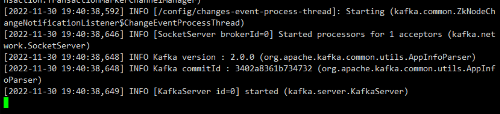
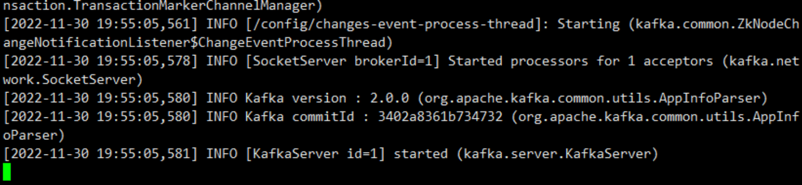
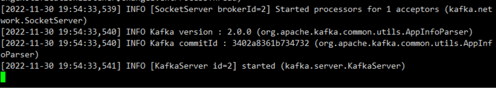

# Kafka安装配置

任务二：完善其他配置并分发kafka文件到bigdata2,bigdata3中，并在每个节点启动Kafka，将bigdata1节点的 Kafka启动命令复制粘贴至对应报告中。

## 解压kafka

```bash
[root@bigdata1 software]# tar -zxvf kafka_2.12-2.4.1.tgz -C /opt/module/
[root@bigdata1 module]# mv kafka_2.12-2.4.1/ kafka
```

## 配置环境变量

```bash
[root@bigdata1 module]# vim /etc/profile
#KAFKA_HOME
export KAFKA_HOME=/opt/module/kafka
export PATH=$PATH:$KAFKA_HOME/bin
[root@bigdata1 module]# source /etc/profile
#分发环境变量，注意在各个节点刷新环境变量
[root@bigdata1 ~]# scp /etc/profile bigdata2:/etc/profile
[root@bigdata1 ~]# scp /etc/profile bigdata3:/etc/profile
```

## 修改server.properties文件

任务一：修改Kafka的server.properties文件，并将修改的内容复制粘贴至对应报告中；

```
[root@bigdata1 opt]# cd /opt/module/kafka/config/
[root@bigdata1 config]# vim server.properties
zookeeper.connect=bigdata1:2181,bigdata2:2181,bigdata3:2181
broker.id=0 		#（bigdata2上写1，bigdata3上写2）注意，每个节点不能写相同的数字，否则会报错
```

任务二：完善其他配置并分发kafka文件到bigdata2,bigdata3中，并在每个节点启动Kafka，将bigdata1节点的 Kafka启动命令复制粘贴至对应报告中。

## 分发kafka

```bash
[root@bigdata1 ~]# scp -r /opt/module/kafka/ bigdata2:/opt/module/
[root@bigdata1 ~]# scp -r /opt/module/kafka/ bigdata3:/opt/module/
```

## 启动kafka

**1.启动kafka之前一定要先启动 zookeeper**

```bash
cd /opt/module/zookeeper/bin		#到目录下

zkServer.sh start（三台都要启动）

[root@bigdata1 bin]# zkServer.sh start
JMX enabled by default
Using config: /opt/module/zookeeper/bin/../conf/zoo.cfg
Starting zookeeper ... STARTED
```

**2.启动 kafka**

```bash
cd /opt/module/kafka/bin
#每个节点都要启动

[root@bigdata1 bin]# kafka-server-start.sh /opt/module/kafka/config/server.properties
```

bigdata1启动成功结果如下图：



bigdata2启动成功结果如下图：



bigdata3启动成功结果如下图：

