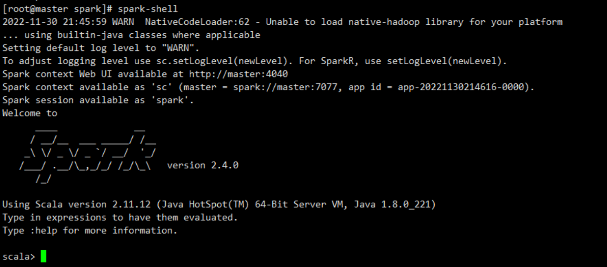

# Spark 组件部署管理

## scala安装配置

任务一：在 bigdata1节点解压 scala 安装包 ，将解压后的安装文件移动到“/opt/module/”路径下并更名为 scala，将全部命令复制并粘贴；

```bash
[root@bigdata1 software]# tar -zxvf scala-2.12.11.tgz -C /opt/module/
[root@bigdata1 module]# mv scala-2.12.11/ scala
```

任务二：设置 scala 环境变量，并使环境变量只对 root 用户生效，将变量配置内容复制粘贴；

```bash
[root@bigdata1 module]# vim /root/.bash_profile
export SCALA_HOME=/opt/module/scala
PATH=$PATH:$SCALA_HOME/bin
[root@bigdata1 module]# source /root/.bash_profile
```

## Spark安装配置

### 一、standalone模式

> Standalone模式是Spark自带的资源调动引擎，构建一个由bigdata1 + Slave构成的Spark集群，Spark运 行在集群中。 这个要和Hadoop中的Standalone区别开来。这里的Standalone是指只用Spark来搭建一个集群，不需要借助其他的框架。是相对于Yarn和Mesos来说的。

------

任务三：在 bigdata1 节 点 解 压 Spark 安装包 ，将解压后的安装文件移动 到“usr/local/src”路径下，更名为 spark，并配置slaves文件，将命令与修改内容复制粘贴；

**1、解压一份Spark安装包，并修改解压后的文件夹名称为spark**

```bash
[root@bigdata1 software]# tar -zxvf spark-3.1.1-bin-hadoop3.2.tgz -C /opt/module/
[root@bigdata1 module]# mv spark-3.1.1-bin-hadoop3.2/ spark
```

**2、配置集群节点**

```bash
[root@bigdata1 conf]# mv slaves.template slaves
[root@bigdata1 conf]# vim slaves
bigdata1
bigdata2
bigdata3
```

**3、配置环境变量**

```bash
[root@bigdata1 conf]# vim /etc/profile.d/bigdata.sh
#SPARK_HOME
export SPARK_HOME=/opt/module/spark
export PATH=$PATH:$SPARK_HOME/bin
[root@bigdata1 conf]# source /etc/profile
```

任务四：修改 spark-env.sh.template为 spark-env.sh并在其中配置 Spark 的 bigdata1 节点主机名、端 口、worker 结点的核数、内存，将修改的配置内容复制粘贴；

```bash
[root@bigdata1 conf]# mv spark-env.sh.template spark-env.sh
[root@bigdata1 conf]# vim spark-env.sh
SPARK_bigdata1_HOST=bigdata1
SPARK_bigdata1_PORT=7077
```

**4、分发spark**

```bash
[root@bigdata1 conf]# scp -r /opt/module/spark/ bigdata2:/opt/module/
[root@bigdata1 conf]# scp -r /opt/module/spark/ bigdata3:/opt/module/
```

任务五：完善其他配置并启动 Spark(Standalone 模式)集群,启动 Spark Shell 连接 集群，将连接结果截 图（截图需包含连接命令）粘贴。

**5、在spark-config.sh中添加JAVA_HOME路径**

```bash
[root@bigdata1 ~]# cd /usr/local/src/spark/sbin/
[root@bigdata1 sbin]# vim spark-config.sh
export JAVA_HOME=/usr/java/jdk1.8.0_221
```

**6、启动spark集群 （注意执行路径）**

```bash
[root@bigdata1 spark]# sbin/start-all.sh
[root@bigdata1 spark]# jps
1347 Worker
1273 Master
1402 Jps
```



### 二、Spark on yarn模式

> spark客户端连接Yarn，不需要额外构建集群。

**1.停止Standalone模式下的spark集群 （注意执行路径）**

```bash
[root@bigdata1 spark]# sbin/stop-all.sh
```

**2.再单独解压一份spark用来做Spark on Yarn 模式**

```bash
[root@bigdata1 software]# tar -zxvf spark-3.1.1-bin-hadoop3.2.tgz -C /opt/module/
[root@bigdata1 module]# mv spark-3.1.1-bin-hadoop3.2/ spark-yarn

```

**3.配置环境变量**

```bash
[root@bigdata1 src]# vim /etc/profile
```

```bash
#SPARK_HOME
export SPARK_HOME=/opt/module/spark-yarn
export PATH=$PATH:$SPARK_HOME/bin
```

**4.修改配置(修改hadoop配置文件/opt/module/hadoop-3.1.3/etc/hadoop/yarn-site.xml)**

当机器内存较少时，防止执行过程进行被意外杀死，可以做如下配置：
修改hadoop配置文件/opt/hadoop-3.1.3/etc/hadoop/yarn-site.xml，添加如下内容

```xml
<property>
	<name>yarn.nodemanager.pmem-check-enabled</name>
	<value>false</value>
</property>
<property>
	<name>yarn.nodemanager.vmem-check-enabled</name>
	<value>false</value>
</property
```

**5.分发配置文件**

```bash
[root@bigdata1 hadoop]# scp -r /opt/module/hadoop-3.1.3/etc/hadoop/yarn-site.xml
bigdata2:/opt/module/hadoop-3.1.3/etc/hadoop
[root@bigdata1 hadoop]# scp -r /opt/module/hadoop-3.1.3/etc/hadoop/yarn-site.xml
bigdata3:/opt/module/hadoop-3.1.3/etc/hadoop
```

**6.修改spark-env.sh**

```bash
[root@bigdata1 conf]# mv spark-env.sh.template spark-env.sh
[root@bigdata1 conf]# vim spark-env.sh
YARN_CONF_DIR=/opt/module/hadoop-3.1.3/etc/hadoop
#注意修改hadoop路径为自己的路径
```

**7.重启Hadoop**

```bash
[root@bigdata1 opt]# stop-dfs.sh
[root@bigdata1 opt]# stop-yarn.sh
[root@bigdata1 opt]# start-dfs.sh
[root@bigdata1 opt]# start-yarn.sh
```

