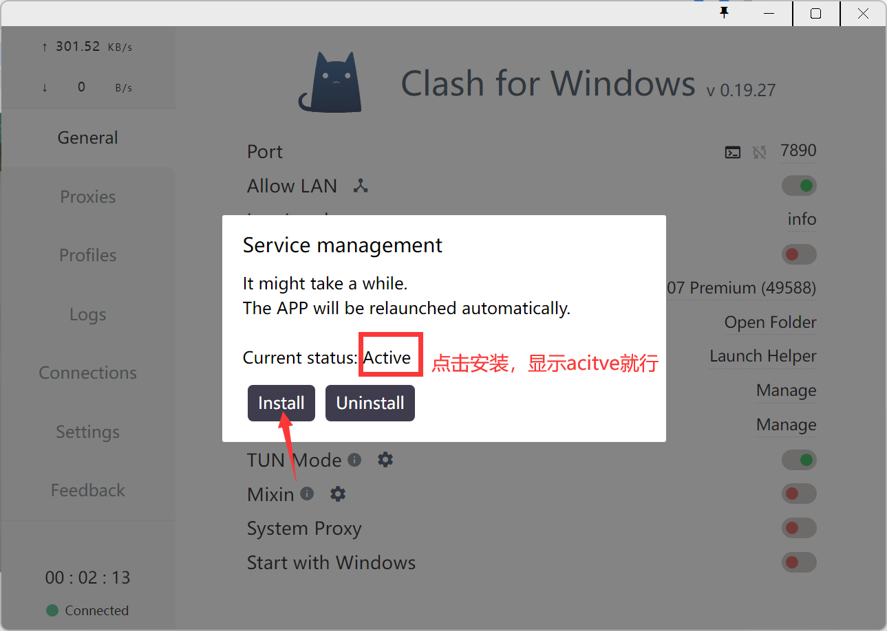

# 科学上网

> [!ATTENTION]
> 请勿用于违法用途，仅限于学习使用，便于访问github等网站。

## 1.购买代理服务：

付费的代理服务使用起来更稳定，速度更快，免费的也可以用，但是需要不够稳定。

在此推荐魔戒代理服务，非常便宜好用。

### 1.1 访问 [魔戒](https://www.mojie.cyou/) 

注册账号，登录。

### 1.2 购买订阅

选择合适的订阅购买

按流量付费就很棒！推荐购买130G流量的，足够使用。

## 2.导入Clash代理工具

### 2.1 下载Clash

[【点击下载中文版】](https://ghproxy.com/https://github.com/ender-zhao/Clash-for-Windows_Chinese/releases/download/CFW-V0.20.9_CN/Clash.for.Windows.Setup.0.20.9.exe)

[【点击下载英文版】](https://ghproxy.com/https://github.com/Fndroid/clash_for_windows_pkg/releases/download/0.20.9/Clash.for.Windows.Setup.0.20.9.exe)

下载之后，安装即可

### 2.2 导入Clash

**复制下来的订阅地址可以粘贴并下载下来**

**选择代理服务**

**开启TUN服务（若安装Service Mode失败，可不用开启）**

**开启系统代理**

**访问任意国外网站，如[Google](https://www.google.com/)，[Youtube](https://www.youtube.com/)，[Github](https://github.com/)等，若能访问成功则代理配置成功**

